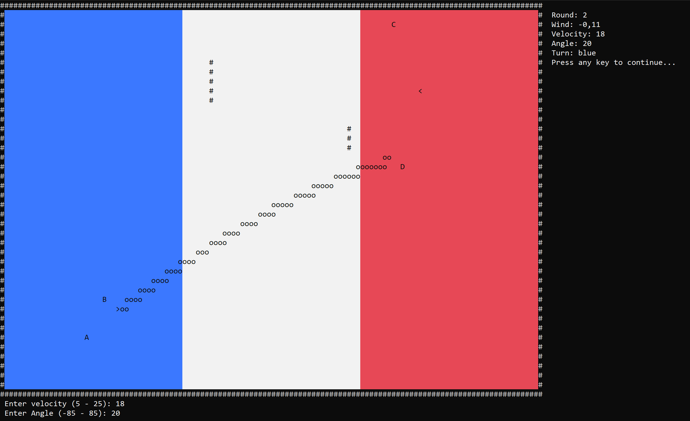

# Snowball Game

This project is a **two-player strategy game** developed for the **CME1251 course (Fall 2025–2026)**.

The game simulates a snowball battle between two teams: **Blue Team** and **Red Team**. Each team has **two snowmen and one thrower**. Players throw snowballs by entering a velocity and angle to hit the opponent's snowmen while considering environmental factors such as **gravity and wind**.

The objective of the game is to eliminate the opponent's snowmen while protecting your own team.

---

# Features

- Two-player competitive gameplay
- Random placement of players and obstacles
- Random **wind force** affecting projectile movement
- Snowball trajectory simulation
- Interactive player input for velocity and angle
- Multiple rounds and turn-based gameplay
- Physics-based projectile motion
- Score and win condition detection

---

# Game Mechanics

The game is played on a **40 × 120 grid** divided into three zones:

[ Blue Zone ] [ Neutral Zone ] [ Red Zone ]


Each zone has a size of **40 × 40** squares.

- Blue team occupies the left zone.
- Red team occupies the right zone.
- The center is a **neutral zone**.

Two **vertical walls** are randomly placed in the neutral zone at the beginning of the game. :contentReference[oaicite:1]{index=1}

---

# Game Rules

- Each team has **2 snowmen and 1 thrower**.
- Teams take turns throwing snowballs.
- The thrower enters:
  - **Velocity**
  - **Angle**
- The snowball follows a trajectory affected by:
  - Gravity
  - Wind

If a team **loses both snowmen**, that team loses the game. :contentReference[oaicite:2]{index=2}

Additional rules:

- Hitting your own snowman removes it.
- Hitting the opponent’s thrower forces that thrower to **skip the next turn**.

---

# Physics Parameters

The game uses the following values:
- Gravity (g) = -1
- Wind Force = -2.00 to 2.00
- Velocity Range = 5.00 – 25.00
- Angle Range = -85° – 85°

  
Wind changes every round and affects the horizontal movement of the snowball. :contentReference[oaicite:3]{index=3}

---

# Gameplay Flow

1. The game initializes the map.
2. Teams and obstacles are placed randomly.
3. Wind speed is generated.
4. The current player enters velocity and angle.
5. The snowball trajectory is calculated and drawn.
6. Collisions with snowmen or walls are detected.
7. Turns continue until one team loses both snowmen.

---

# Technologies Used

- C#
- .NET
- Algorithm Design
- Physics Simulation

---

# Example Gameplay

Below is an example of the game screen.



---

# How to Run the Project

1. Clone the repository

```bash
git clone https://github.com/edakirci/SnowballGame.git

```
2. Open the project in Visual Studio

3. Build the project

   Build → Build Solution

4.Run the project

Debug → Start Without Debugging

---
# Course Information
Course: CME1251 - Project based Learning I

Semester: Fall 2025–2026

